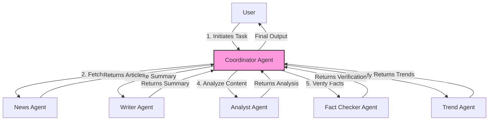
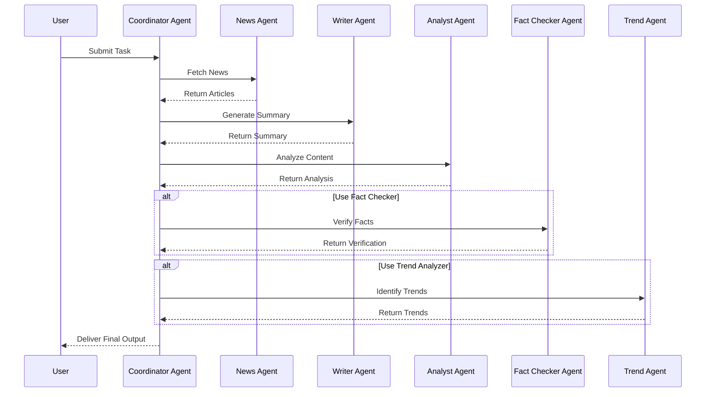
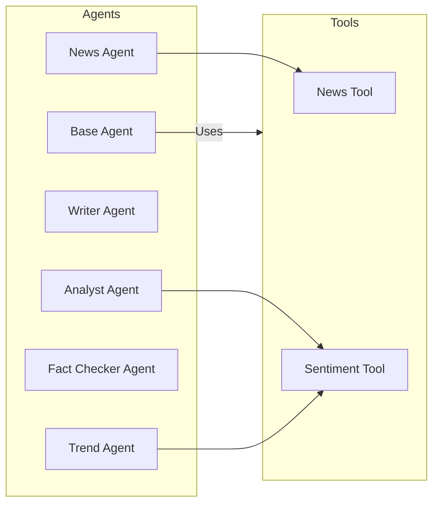

# AgentToast

A powerful multi-agent AI framework built on the OpenAI Agents SDK for comprehensive news analysis, with financial data lookup and enhanced agent capabilities.

## Setup

1. Clone the repository
2. Create and activate a virtual environment:
   ```bash
   python -m venv .venv
   source .venv/bin/activate  # On Windows: .venv\Scripts\activate
   ```
3. Install dependencies:
   ```bash
   pip install -r requirements.txt
   ```
4. Create a `.env` file with your OpenAI API key and News API key:
   ```
   OPENAI_API_KEY=your_openai_api_key_here
   NEWS_API_KEY=your_news_api_key_here
   ```
   Get a News API key from [newsapi.org](https://newsapi.org/)

## Usage

### Interactive CLI

(Note: Interactive CLI support for new features like ticker symbol and per-agent models may be added later.)

The easiest way to use AgentToast is through the interactive CLI:

```bash
python cli.py
```

This will guide you through selecting news categories, agent modes, and various configuration options with a user-friendly interface.

### Running with Command Line Arguments

Alternatively, you can run the multi-agent system with command line arguments:

```bash
python run_agent.py --agent coordinator --category technology --count 3 --model gpt-4
```

#### Basic Options
- `--agent`: The agent to run (`news`, `planner`, `coordinator`, or `all`).
- `--category`: News category (top-headlines, general, business, technology, sports, etc.).
- `--count`: Number of articles to fetch (1-10).
- `--model`: Default model to use if specific agent model is not set (e.g., `gpt-3.5-turbo`, `gpt-4-turbo-preview`).
- `--temperature`: Global model temperature (0.0-1.0) applied to all LLM-based agents.
- `--verbose`: Enable verbose output for all agents.
- `--trace`: Enable LangSmith tracing.

#### Per-Agent Model Overrides
- `--news-model`: Override model for NewsAgent.
- `--planner-model`: Override model for PlannerAgent.
- `--analyst-model`: Override model for AnalystAgent.
- `--factchecker-model`: Override model for FactCheckerAgent.
- `--trend-model`: Override model for TrendAgent.
- `--writer-model`: Override model for WriterAgent.
(If an override is not specified, the agent uses the default `--model`.)

#### Financial Data Options
- `--ticker`: Optional stock ticker symbol (e.g., `AAPL`, `GOOGL`) to fetch financial data using the FinanceAgent.

#### Audio Options
- `--voice`: Voice to use for audio output (alloy, echo, fable, onyx, nova, shimmer).
- `--no-audio`: Disable audio generation.
- `--play-audio`: Play the audio file immediately.
- `--output-dir`: Directory for saving output files (default: `output`).
- `--summary-style`: Style of the audio summary (formal, conversational, brief).

#### Analysis Options
- `--analysis-depth`: Depth of analysis (basic, moderate, deep).
- `--no-fact-check`: Disable FactCheckerAgent.
- `--no-trend-analysis`: Disable TrendAgent.
- `--max-fact-claims`: Maximum number of fact claims to check (default: 5).

#### Output Options
- `--save-markdown`: Save the generated news summary as a Markdown file.
- `--save-analysis`: Save the analysis as a separate file.
- `--full-report`: Generate a comprehensive report with all agent outputs.

#### Advanced News API Options
- `--country`: Two-letter country code (e.g., us, gb).
- `--sources`: Comma-separated list of news sources (e.g., bbc-news,cnn).
- `--query`: Keywords or phrase to search for.
- `--page`: Page number for paginated results.

### Example Commands

Run a full multi-agent analysis on technology news:
```bash
python run_agent.py --agent coordinator --category technology --count 3 --analysis-depth deep --full-report
```

Get business news and fetch financial data for Apple:
```bash
python run_agent.py --agent coordinator --category business --ticker AAPL
```

Get top headlines using GPT-4 Turbo for the Analyst and FactChecker, but GPT-3.5 for others:
```bash
python run_agent.py --agent coordinator --category top-headlines --count 5 \
    --model gpt-3.5-turbo \
    --analyst-model gpt-4-turbo-preview \
    --factchecker-model gpt-4-turbo-preview
```

Get business news with fact checking but without trend analysis:
```bash
python run_agent.py --agent coordinator --category business --no-trend-analysis
```

Get science news with a formal summary style and play the audio:
```bash
python run_agent.py --agent coordinator --category science --summary-style formal --play-audio
```

Save comprehensive analysis as separate files:
```bash
python run_agent.py --agent coordinator --category politics --save-markdown --save-analysis
```

## Features

- **Interactive CLI**: User-friendly command line interface for easy configuration (basic features).
- **Multi-Agent Architecture**: Specialized agents work together for comprehensive news analysis:
  - **NewsAgent**: Fetches and processes articles from various sources (NewsAPI).
  - **AnalystAgent**: Provides deeper insights and analysis, enhanced with web search capabilities.
  - **FactCheckerAgent**: Verifies key claims using web search for evidence.
  - **TrendAgent**: Identifies patterns and trends, using web search for validation and discovery.
  - **FinanceAgent**: Fetches stock market data for a given ticker symbol (Yahoo Finance).
  - **WriterAgent**: Creates concise, engaging summaries for text and audio.
  - **CoordinatorAgent**: Orchestrates the entire workflow.
  - **PlannerAgent**: Plans the overall workflow strategy.
- **Parallel Processing**: Analysis, fact-checking, and trend detection run concurrently for efficiency.
- **Web-Enhanced Analysis**: FactChecker, Analyst, and Trend agents leverage OpenAI's `WebSearchTool` for up-to-date information and broader context.
- **Financial Data Integration**: Fetch and display Yahoo Finance stock data alongside news analysis.
- **Flexible Model Selection**: Use a default LLM or specify different models per agent type via CLI.
- **Intelligent Audio Summaries**: Generates accurate audio summaries using OpenAI TTS.
- **Customizable Analysis**: Control analysis depth, fact-checking, and trend analysis.
- **Markdown Formatting**: Well-structured outputs with proper formatting.
- **Multiple Voice Options**: Choose from different voices for audio output.
- **Comprehensive Reports**: Generate detailed reports combining all agent outputs.
- **Top Headlines Category**: Get the most important news across all categories.

## News Categories

AgentToast supports the following news categories:
- **top-headlines**: The most important news across all categories.
- **general**: General news from various sources.
- **business**: Business and financial news.
- **technology**: Technology and innovation news.
- **sports**: Sports news and updates.
- **entertainment**: Entertainment industry news.
- **health**: Health and medical news.
- **science**: Science news and discoveries.

## Agent Modes

- **news**: Run only the NewsAgent to fetch and summarize articles.
- **planner**: Run the PlannerAgent to create a processing plan.
- **coordinator**: Run the CoordinatorAgent to orchestrate multiple agents (News, Analyst, FactChecker, Trend, Finance, Writer).
- **all**: Run both the PlannerAgent and CoordinatorAgent in sequence.

## Trend Analysis

The TrendAgent identifies patterns and connections across articles, providing insights into:

- Emerging, growing, or established trends.
- Short, medium, and long-term timeframes.
- Meta-trends that connect multiple individual trends.
- Supporting evidence from articles and web search.
- Implications for readers and stakeholders.

## Fact Checking

The FactCheckerAgent verifies key claims in articles:

- Identifies factual statements from articles.
- Uses web search to find corroborating or conflicting evidence.
- Assesses each claim as Verified, Needs Context, or Unverified.
- Provides explanations for each assessment, citing sources.
- Rates confidence level for each verification.
- Summarizes overall findings.

## Monitoring Agent Interactions

The AgentToast system is built on a multi-agent architecture where several specialized agents work together. To monitor how agents are interacting with each other:

1. **View the coordinator agent's output:** 
   - Run `python run_agent.py --agent coordinator --verbose --trace` to enable verbose output and tracing
   - The coordinator will show each agent's execution and how their outputs are passed to other agents
   - Look for the "Agent Team Performance" section to see which agents ran successfully

2. **Check agent results in the full report:**
   - Add `--full-report` flag when running the system 
   - The generated report shows results from each agent and how they build on each other

3. **Examine generated trace logs:**
   - Enable tracing with `--trace` flag
   - Trace IDs are displayed at the end of each agent run
   - These traces show complete execution flow including inter-agent communication

4. **Review code flow:**
   - The `CoordinatorAgent.run()` method shows the multi-agent workflow
   - Agent results are collected in the `agent_results` list
   - Outputs from NewsAgent become inputs for AnalystAgent, FactCheckerAgent, and TrendAgent
   - WriterAgent uses outputs from all previous agents to create the final summary

5. **Observe context sharing:**
   - The system compiles outputs from multiple agents into a context for the WriterAgent
   - This demonstrates how information flows between agents

The system primarily uses orchestrated sequencing where the coordinator passes data between specialized agents rather than direct agent-to-agent communication.

## Recent Improvements

Recent updates to AgentToast have enhanced its functionality and reliability:

1. **Yahoo Finance Integration**: Added `FinanceAgent` and `--ticker` option to fetch stock data.
2. **Per-Agent Model Configuration**: Added `--<agent>-model` flags to `run_agent.py` for granular model control.
3. **Web Search Enhancement**: Integrated OpenAI `WebSearchTool` into `FactCheckerAgent`, `AnalystAgent`, and `TrendAgent` for enhanced context and verification.
4. **Robust Article Extraction**: Improved parsing of different markdown formats.
5. **Enhanced Trend Analysis**: Better identification of patterns across articles.
6. **Planner Agent Optimizations**: More reliable output parsing.
7. **Improved Data Flow**: More reliable data passage between agents.
8. **Agent Visualization Tools**: Tools for visualizing agent relationships.

## Project Structure

- `src/`: Core source code
  - `agents/`: Contains agent implementations
    - `base_agent.py`: Base agent class with tracing and common functionality
    - `example_agent.py`: News agent implementation
    - `writer_agent.py`: Writer agent for concise summaries
    - `analyst_agent.py`: Analysis agent for deeper insights
    - `fact_checker_agent.py`: Fact checking agent for verification
    - `trend_agent.py`: Trend detection agent for patterns
    - `finance_agent.py`: Financial data agent for stock data
    - `coordinator_agent.py`: Multi-agent coordinator
    - `planner_agent.py`: Planning agent for workflow orchestration
  - `tools/`: Contains tool implementations
    - `news_tool.py`: Tool for fetching news from NewsAPI
    - `finance_tool.py`: Tool for fetching stock data from Yahoo Finance
    - `sentiment_tool.py`: Tool for sentiment analysis of news content
  - `utils/`: Utility functions and helpers
    - `tts.py`: Text-to-speech utilities for audio generation
    - `tracing.py`: Utilities for tracing agent execution
    - `diagram.py`: Utilities for agent visualization
  - `config.py`: Configuration settings for the application
  - `main.py`: Main entry point for the application
- `run_agent.py`: Command-line entry point for running agents
- `cli.py`: Interactive CLI interface for easy configuration
- `agent_diagram.md`: Mermaid diagrams showing agent interactions
- `agent_diagram.html`: Interactive D3.js visualization of agent relationships
- `generate_agent_diagram.py`: Script to auto-generate diagrams from codebase
- `visualize_agents.sh`: Shell script to run diagram tools
- `AGENT_DIAGRAMS.md`: Documentation on using the diagram tools
- `output/`: Directory where output files are saved
- `tests/`: Unit tests for the application
- `requirements.txt`: Dependencies for the project

## Development

### Adding New Agents

1. Create a new file in `src/agents/` with your agent class
2. Extend the `BaseAgent` class
3. Implement the required methods
4. Update the coordinator to use your new agent

### System Architecture

The system uses a team of specialized agents coordinated by a central coordinator:

1. **NewsAgent**: Fetches articles and creates initial summary
2. **AnalystAgent**, **FactCheckerAgent**, and **TrendAgent** run in parallel:
   - **AnalystAgent**: Analyzes the news for insights and implications
   - **FactCheckerAgent**: Verifies key claims in the articles
   - **TrendAgent**: Identifies patterns and connections
3. **WriterAgent**: Creates a concise summary for audio output that accurately reflects the news content
4. **CoordinatorAgent**: Orchestrates the workflow and consolidates results

#### Agent Interaction Diagrams

The following diagrams illustrate how agents in AgentToast interact:

##### Agent Architecture Overview



##### Message Flow Sequence



##### Agent & Tool Relationships



For more detailed visualizations, run the `./visualize_agents.sh` script included in the repository.

### Testing

The project includes a unit test suite in the `tests/` directory. To run the tests:

```bash
pytest
```

### Key Features

- **Enhanced Audio Summaries**: Audio summaries accurately reflect the actual content of the news articles
- **Web-Enhanced Analysis**: FactChecker, Analyst, and Trend agents leverage OpenAI's `WebSearchTool` for up-to-date information and broader context
- **Financial Data**: Integrates Yahoo Finance stock data via `--ticker`
- **Flexible Model Choice**: Set default or per-agent LLMs via CLI
- **Context-Aware Writer**: The WriterAgent uses additional context from analysis and fact-checking to create more informative summaries
- **Parallel Processing**: Analysis, fact-checking, and trend detection run simultaneously for efficiency
- **Flexible Output Options**: Generate everything from brief audio summaries to comprehensive written reports
- **Custom Summary Styles**: Choose between formal, conversational, or brief summary styles to match your preference
- **Robust Error Handling**: Graceful handling of API errors, parsing issues, and edge cases 
