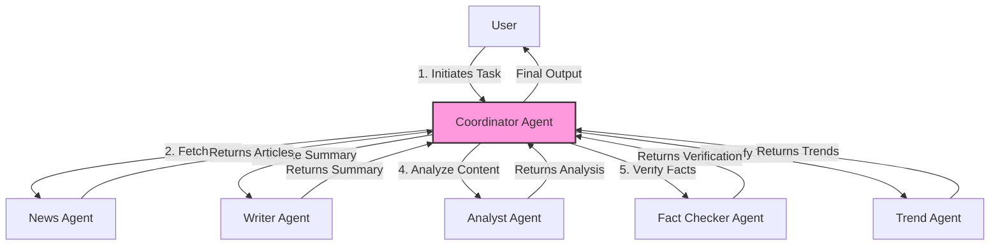
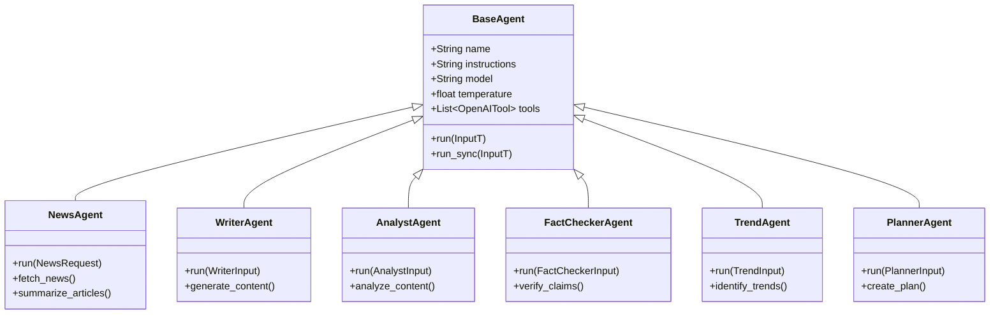
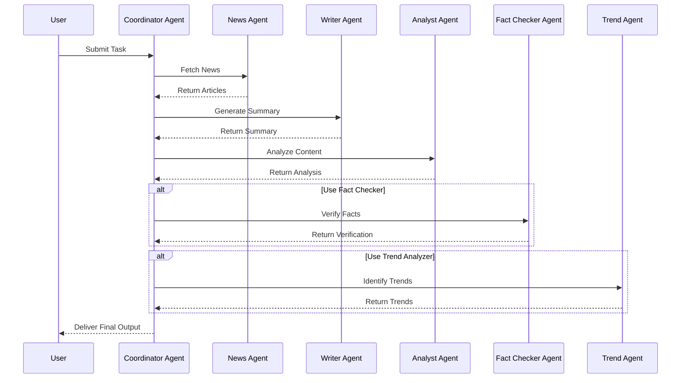
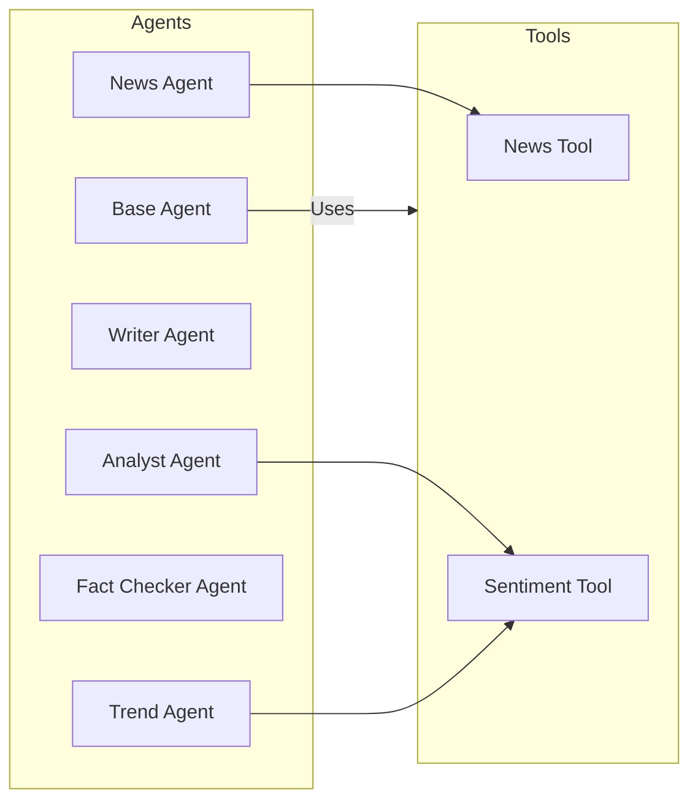
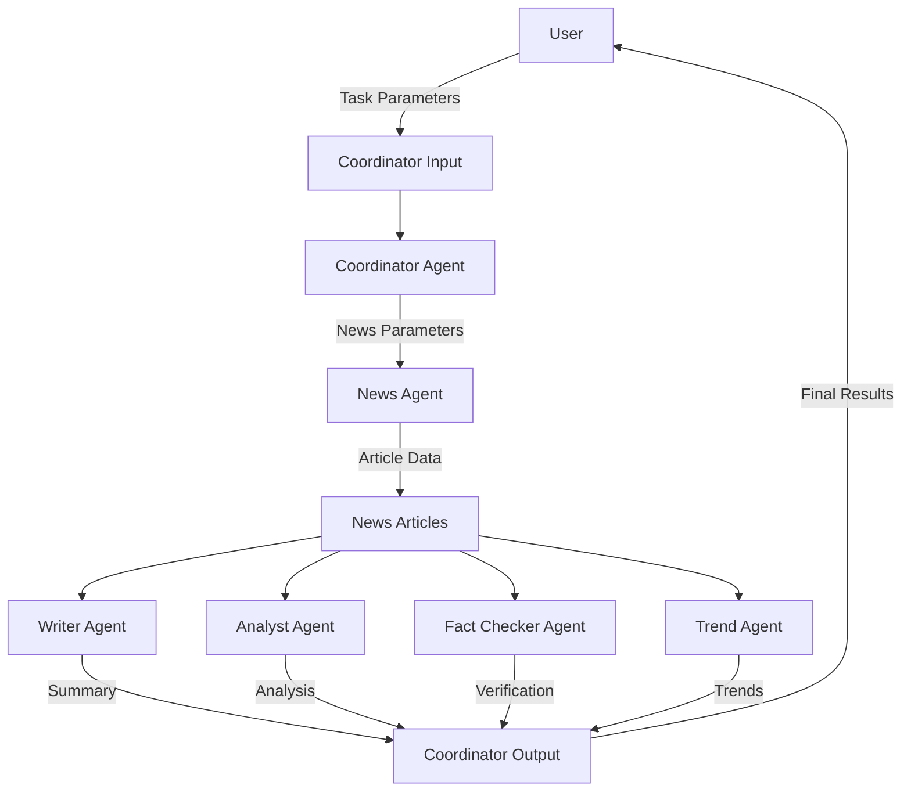

# Agent Interaction Diagram

## Agent Architecture Overview

```mermaid
graph TD
    User[User] --> |1. Initiates Task| Coordinator[Coordinator Agent]
    Coordinator --> |2. Fetch News| NewsAgent[News Agent]
    Coordinator --> |3. Create Summary| WriterAgent[Writer Agent]
    Coordinator --> |4. Analyze Content| AnalystAgent[Analyst Agent]
    Coordinator --> |5. Verify Facts| FactCheckerAgent[Fact Checker Agent]
    Coordinator --> |6. Identify Trends| TrendAgent[Trend Agent]
    
    NewsAgent --> |Returns Articles| Coordinator
    WriterAgent --> |Returns Summary| Coordinator
    AnalystAgent --> |Returns Analysis| Coordinator
    FactCheckerAgent --> |Returns Verification| Coordinator
    TrendAgent --> |Returns Trends| Coordinator
    
    Coordinator --> |Final Output| User
    
    class Coordinator primary;
    classDef primary fill:#f9d,stroke:#333,stroke-width:2px;
```

## Agent Class Hierarchy

```mermaid
classDiagram
    BaseAgent <|-- NewsAgent
    BaseAgent <|-- WriterAgent
    BaseAgent <|-- AnalystAgent
    BaseAgent <|-- FactCheckerAgent
    BaseAgent <|-- TrendAgent
    BaseAgent <|-- PlannerAgent
    
    class BaseAgent {
        +String name
        +String instructions
        +String model
        +float temperature
        +List~OpenAITool~ tools
        +run(InputT)
        +run_sync(InputT)
    }
    
    class NewsAgent {
        +run(NewsRequest)
        +fetch_news()
        +summarize_articles()
    }
    
    class WriterAgent {
        +run(WriterInput)
        +generate_content()
    }
    
    class AnalystAgent {
        +run(AnalystInput)
        +analyze_content()
    }
    
    class FactCheckerAgent {
        +run(FactCheckerInput)
        +verify_claims()
    }
    
    class TrendAgent {
        +run(TrendInput)
        +identify_trends()
    }
    
    class PlannerAgent {
        +run(PlannerInput)
        +create_plan()
    }
```

## Message Flow Sequence

```mermaid
sequenceDiagram
    participant User
    participant Coordinator as Coordinator Agent
    participant News as News Agent
    participant Writer as Writer Agent
    participant Analyst as Analyst Agent
    participant FactChecker as Fact Checker Agent
    participant Trend as Trend Agent
    
    User->>Coordinator: Submit Task
    Coordinator->>News: Fetch News
    News-->>Coordinator: Return Articles
    
    Coordinator->>Writer: Generate Summary
    Writer-->>Coordinator: Return Summary
    
    Coordinator->>Analyst: Analyze Content
    Analyst-->>Coordinator: Return Analysis
    
    alt Use Fact Checker
        Coordinator->>FactChecker: Verify Facts
        FactChecker-->>Coordinator: Return Verification
    end
    
    alt Use Trend Analyzer
        Coordinator->>Trend: Identify Trends
        Trend-->>Coordinator: Return Trends
    end
    
    Coordinator-->>User: Deliver Final Output
```

## Agent & Tool Relationships

```mermaid
graph LR
    Base[Base Agent] --> |Uses| Tools[Tools]
    
    subgraph Agents
        Base
        News[News Agent]
        Writer[Writer Agent]
        Analyst[Analyst Agent]
        FactChecker[Fact Checker Agent]
        Trend[Trend Agent]
    end
    
    subgraph Tools
        News_Tool[News Tool]
        Sentiment_Tool[Sentiment Tool]
    end
    
    News --> News_Tool
    Analyst --> Sentiment_Tool
    Trend --> Sentiment_Tool
```

## Data Flow Diagram

```mermaid
flowchart TD
    User[User] --> |Task Parameters| Input[Coordinator Input]
    Input --> Coordinator[Coordinator Agent]
    
    Coordinator --> |News Parameters| News[News Agent]
    News --> |Article Data| Articles[News Articles]
    
    Articles --> Writer[Writer Agent]
    Articles --> Analyst[Analyst Agent]
    Articles --> FactChecker[Fact Checker Agent]
    Articles --> Trend[Trend Agent]
    
    Writer --> |Summary| Output[Coordinator Output]
    Analyst --> |Analysis| Output
    FactChecker --> |Verification| Output
    Trend --> |Trends| Output
    
    Output --> |Final Results| User
``` 